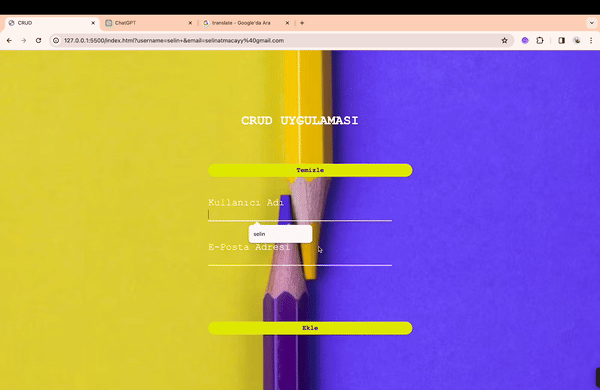

<h1> weatherApp </h1>

I've completed a project developed using JavaScript, which includes a basic web application capable of performing database operations. The project features a simple and user-friendly interface allowing users to easily add new data, view existing data, update, and delete.

<h2> The technologies used in the project </h2>

It was coded using Html, Css and JavaScript technologies.

<h2> Screenshot </h2>

# crudProject
